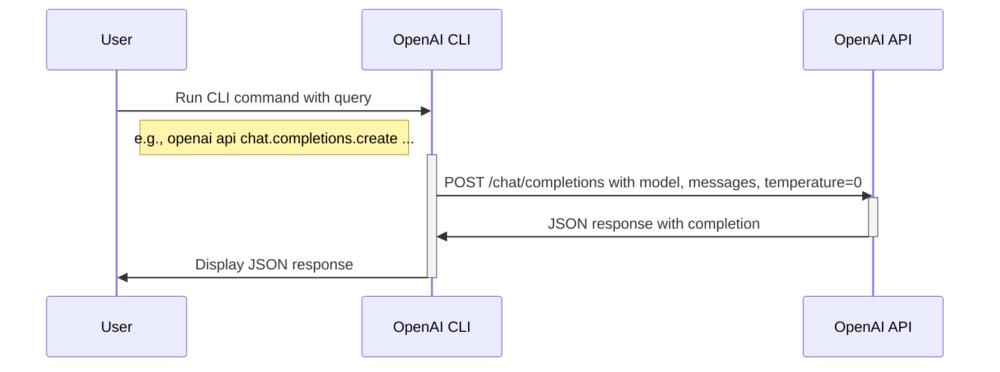

# Use the OpenAI CLI

In this exercise, you’ll learn to interact with a large language model (LLM)
using the OpenAI CLI by asking a simple question:
> Answer in up to 3 words: Which ocean contains Bouvet Island?

The expected response is "Atlantic Ocean". If the output differs, the model may
have hallucinated: rerun the command for accuracy.



### Run the OpenAI CLI

Choose one of these methods to execute the OpenAI CLI:

<details>
<summary>Docker</summary>

```bash
docker compose run --build --rm cli
```

</details>

<details>
<summary>Shell</summary>

First, install required packages:
```bash
pip install openai 'python-dotenv[cli]'
```

Ensure your `../env` file includes at least `OPENAI_API_KEY`. If not, revisit
the [OpenAI prerequisites](../README.md#openai).

Then, query the LLM:
```bash
dotenv -f ../.env run -- sh -c 'openai api chat.completions.create \
  -t 0 -m ${CHAT_MODEL} \
  --message user "Answer in up to 3 words: Which ocean contains Bouvet Island?"'
```

</details>
