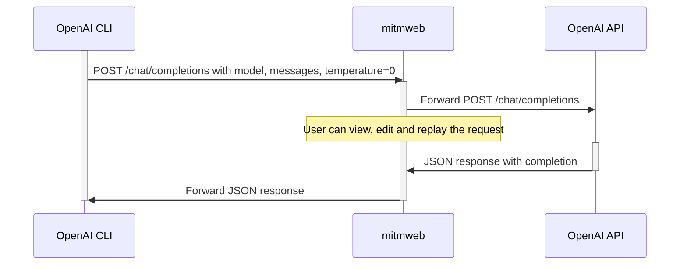
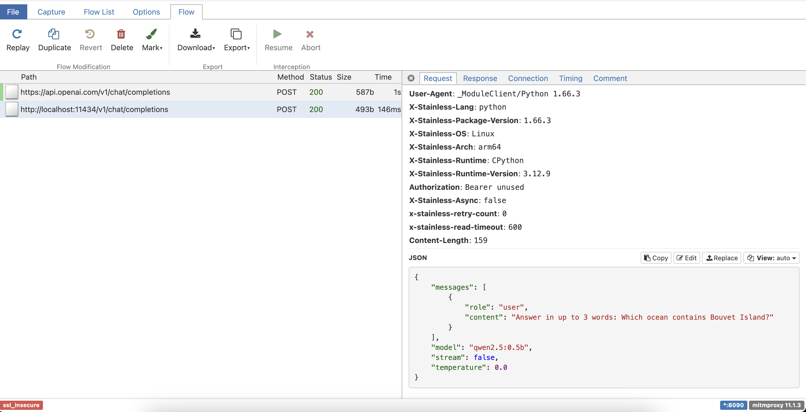

# Inspect OpenAI traffic with mitmproxy

[mitmproxy](https://mitmproxy.org/) is an open source interactive HTTPS proxy.
We'll use its `mitmweb` to view or edit flows between the OpenAI CLI and your
OpenAI endpoint.



Here's an example screenshot:



## Launch mitmweb

To use [mitmproxy](https://mitmproxy.org/), do the following:

1. Make sure `mitmproxy` is installed (e.g. `brew install mitmproxy`)
2. Run this a separate terminal:
   ```bash
   mitmweb --mode regular --ssl-insecure --set confdir=.mitmproxy -p 8090 --web-port 8091
   ```

## Run the OpenAI CLI through mitmproxy

Applications typically use environment variables to configure HTTP proxies:
* `HTTP_PROXY` for plain text HTTP traffic
* `HTTPS_PROXY` and `SSL_CERT_FILE` for encrypted HTTPS traffic

Create a .env file with proxy settings for the `mitmweb` server you launched:
```bash
(cat ../.env; echo; cat .env.mitm) > .env
```

Choose a method to run the OpenAI CLI with these settings:

<details>
<summary>Docker</summary>

```bash
docker compose run --build --rm cli
```

</details>

<details>
<summary>Shell</summary>

Install dependencies:  
```bash
pip install openai 'python-dotenv[cli]'
```

Run the CLI:
```bash
dotenv run -- sh -c 'openai api chat.completions.create \
   -t 0 -m ${CHAT_MODEL} \
  --message user "Answer in up to 3 words: Which ocean contains Bouvet Island?"'
```

</details>

## Inspect traffic

Access http://127.0.0.1:8091/#/flows to view HTTP flows.

*Caution*: Avoid screen-sharing with authenticated providers.

You'll notice you can edit and replay OpenAI requests. However, this won't work
for LLM APIs that have time/body-sensitive headers (e.g., AWS Bedrock SigV4).

When finished, hit `^C` in the terminal window of your `mitmweb` process.

## Offline replay

While `mitmproxy` can save flows for offline replay with `--server-replay`, we
will use a different approach in [exercise 6](../06-http-replay).

---
[first]: ../01-start
