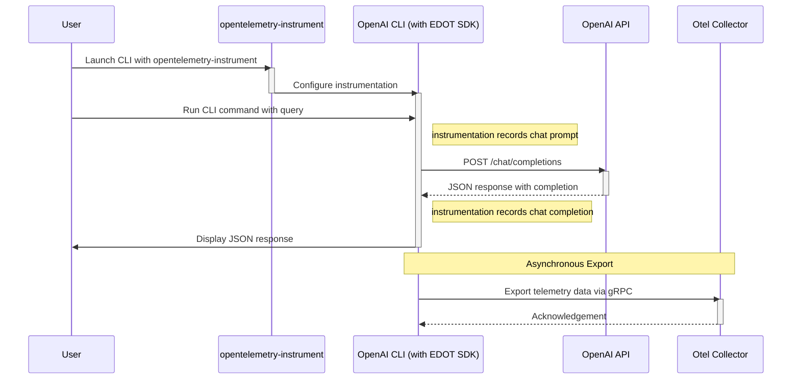
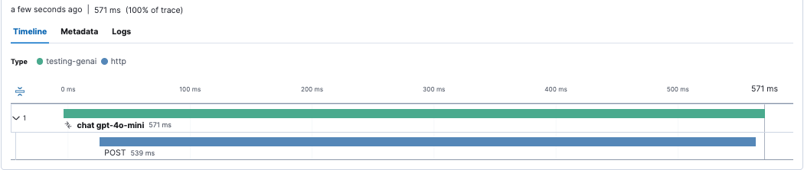

# Trace OpenAI traffic with OpenTelemetry

In this exercise, you’ll learn to export logs, metrics, and traces from the
OpenAI CLI using OpenTelemetry, without modifying its source code.

When viewed in an APM like Kibana, GenAI signals reveal token usage, chat
latency, and tool interactions (e.g., DuckDuckGo), answering questions like
"Which model version generated this response?" or "What prompt did my RAG
application create?"

This complements [traffic inspection][prev] but requires no proxy or CLI
changes, leveraging "zero code instrumentation."




## Elastic Distributions of OpenTelemetry (EDOT) Python

[EDOT Python][edot-python] instruments Python applications, such as the OpenAI
CLI, without altering their source. Prefixing with `opentelemetry-instrument`
enables automatic export of logs, metrics, and traces.

*Note*: Set `OTEL_SDK_DISABLED=true` to disable OpenTelemetry, allowing users
to opt out without modifying packaging.

## Run the OpenAI CLI with EDOT Python

Choose a method to instrument the CLI and export telemetry:

<details>
<summary>Docker</summary>

```bash
docker compose run --build --rm cli
# or to disable opentelemetry-instrument without changing your Dockerfile
docker compose run --env OTEL_SDK_DISABLED=true --build --rm cli
```

</details>

<details>
<summary>Shell</summary>

Install dependencies from [requirements.txt](requirements.txt).
```bash
pip install -r requirements.txt
```

Bootstrap instrumentation (this only needs to happen once):
```bash
edot-bootstrap --action=install
```

Run the CLI (notice the prefix of `opentelemetry-instrument):
```bash
dotenv -f ../.env run --no-override -- sh -c 'opentelemetry-instrument \
  openai api chat.completions.create \
  -t 0 -m ${CHAT_MODEL} \
  --message user "Answer in up to 3 words: Which ocean contains Bouvet Island?"'
```

</details>

## Inspect your traces!

EDOT's OpenAI instrumentation creates logs with prompt and completion details,
metrics about tokens and latency, and a span for the chat request.

If used our [Local Elastic Stack](../README.md#local-elastic-stack), when you
access Kibana on localhost, use elastic as both username and password:
http://localhost:5601/app/apm/traces?rangeFrom=now-15m&rangeTo=now

Here's an example screenshot:



---
[prev]: ../02-proxy
[first]: ../01-start
[edot-python]: https://github.com/elastic/elastic-otel-python
