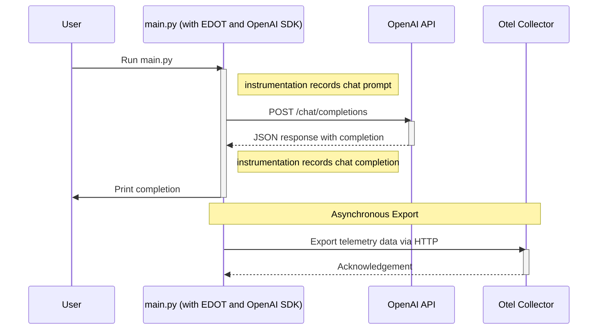

# Write an OpenAI Application

Building on previous exercises where we used the OpenAI CLI, this exercise
teaches you how to write a Python script that asks the same question:
> Answer in up to 3 words: Which ocean contains Bouvet Island?

[main.py](main.py) uses the same [OpenAI Python SDK][openai-python] as the
OpenAI CLI. With a custom script, we can simply call `python3 main.py` instead
of crafting a long `openai` command.




## Running main.py

Choose one of the following ways to run [main.py](main.py).

<details>
<summary>Docker</summary>

```bash
docker compose run --build --rm main
# or to opt-out of OpenTelemetry
docker compose run --env OTEL_SDK_DISABLED=true --build --rm main
```

</details>

<details>
<summary>Shell</summary>

First, install the same packages as the [previous exercise][prev], except in
this case we don't need the `dotenv` CLI, since we are using it as a library.
```bash
pip install -r requirements.txt
```

Then, run `edot-bootstrap` if you haven't, yet.
```bash
edot-bootstrap --action=install
```

Now, run [main.py](main.py) with or without OpenTelemetry.
```bash
python3 main.py
# or to opt-out of OpenTelemetry
OTEL_SDK_DISABLED=true python3 main.py
```

</details>

## Environment variables

All OpenAI SDKs use the same ENV variables as the CLI. This means what you
configured earlier will automatically be used in your application by default.

In [main.py](main.py), `client = OpenAI()` reads `OPENAI_BASE_URL` and
`OPENAI_API_KEY` from the environment. There is no OpenAI ENV variable for a
default model, so we use `os.getenv("CHAT_MODEL", "gpt-4o-mini")` to read the
same value as we use in the CLI.

The following to addition to [main.py](main.py) has the same effect as running
Python with `dotenv run --no-override --`, loading all ENV variables.

```python
from dotenv import load_dotenv
load_dotenv(dotenv_path="../.env")
```

## OpenTelemetry

The Elastic Distribution of OpenTelemetry (EDOT) Python SDK includes a feature
for "programmatic auto-instrumentation". The following to addition to
[main.py](main.py) has the same effect as running Python with
`opentelemetry-instrument`, discussed in the [previous exercise][prev].

```python
from opentelemetry.instrumentation import auto_instrumentation
auto_instrumentation.initialize()
```

---
[openai-python]: https://github.com/openai/openai-python
[prev]: ../03-opentelemetry
[dotenv]: https://pypi.org/project/python-dotenv/
