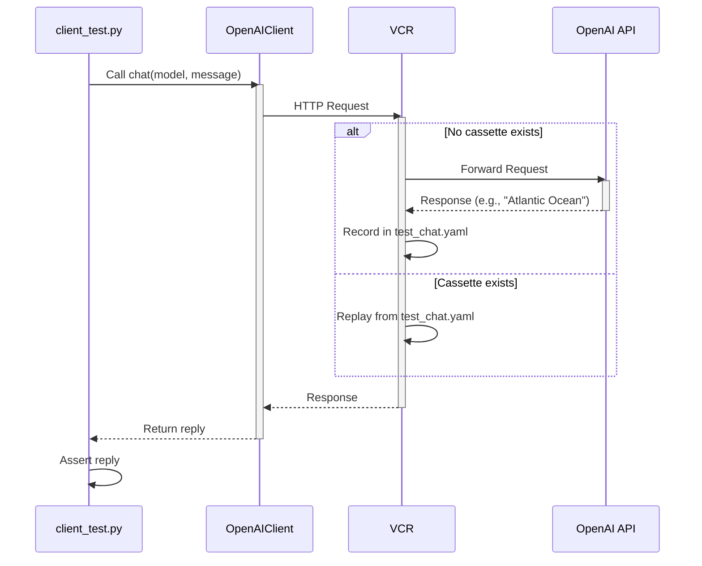

# Unit test your application with recorded HTTP responses

This exercise shows how to capture HTTP traffic from the OpenAI SDK for offline
unit testing, using recorded responses. This ensures consistent tests even
though LLMs are inherently non-deterministic.

[client_test.py](client_test.py) tests a `chat()` function extracted from
[main.py](main.py), using VCR. [pytest-vcr][pytest-vcr] facilitates recording
and replay of HTTP traffic between the OpenAI SDK and the real LLM.



## Running tests

`test_chat()` is not an integration test, so we can run it independently from
`test_main()`, and without any credentials, like below:

<details>
<summary>Docker</summary>

```bash
docker compose run --build --rm test
```

</details>

<details>
<summary>Shell</summary>


First, install the same packages as the [previous exercise][prev], plus
[pytest-vcr][pytest-vcr] now in [requirements-dev.txt](requirements-dev.txt).
```bash
pip install -r requirements.txt
pip install -r requirements-dev.txt
```

Now, run `pytest`, which does not need to read ENV variables (as it is
reads [cassettes/test_chat.yaml][test_chat.yaml]:
```bash
pytest -m vcr
```

</details>

## Extracting a client

We extract `OpenAIClient` into [client.py](client.py), so that we can run the
test both with and without what's hard-coded in [main.py](main.py).

The important part is this:

```python
class OpenAIClient:
    def chat(self, message: str) -> str:
      return "TODO: implement"
```

## Making a VCR test

We then make `test_chat()` in [client_test.py](client_test.py), which invokes
the client with the same parameters as [main.py](main.py).

A cassette (e.g., [test_chat.yaml](cassettes/test_chat.yaml))) stores recorded
HTTP interactions. The `@pytest.mark.vcr` decorator enables recording or replay.

```python
@pytest.mark.vcr
def test_chat():
    reply = OpenAIClient().chat(message)

    assert "Atlantic Ocean" == reply
```

## Why record API responses for replay?

Recording API responses with VCR:
- Ensures deterministic tests for variable LLM outputs
- Enables offline testing without credentials
- Speeds up tests by avoiding live API calls

## How do we prevent recording sensitive headers?

By default, VCR records the whole HTTP request, including any credentials, into
the [cassettes](cassettes) directory.

[conftest.py](conftest.py) has code including below that removes sensitive
headers values sent to or received by your OpenAI API endpoint.

```python
@pytest.fixture(scope="module")
def vcr_config():
    """Scrub sensitive headers and gunzip responses so they are readable"""
    sensitive_request_headers = ["authorization", "cookie", "openai-organization", "openai-project"]
    sensitive_response_headers = {"openai-organization", "set-cookie"}
    return {
        "decode_compressed_response": True,
        "filter_headers": sensitive_request_headers,
        "before_record_response": lambda r: {**r,
            'headers': {k: v for k, v in r['headers'].items() if
                        k.lower() not in sensitive_response_headers}
        }
    }
```

## How do we avoid needing `OPENAI_API_KEY` when running tests offline?

`OpenAI()` fails fast if the `OPENAI_API_KEY` ENV variable, is not set. This
interferes with offline replay which doesn't require this value, failing tests
before a chat request is made.

[conftest.py](conftest.py) a pytest configuration file. To work around this,
we make a test fixture in [conftest.py](conftest.py) which fills in a fake
value for that ENV variable when used.
```python
@pytest.fixture
def default_openai_env(monkeypatch):
    """Prevent offline tests from failing due to requiring the ENV OPENAI_API_KEY."""

    if "OPENAI_API_KEY" not in os.environ:
        monkeypatch.setenv("OPENAI_API_KEY", "test_openai_api_key")
```

Importantly, our VCR tests need to use that fixture, by accepting it as a
parameter like this:
```python
@pytest.mark.vcr
def test_chat(default_openai_env):
    reply = OpenAIClient().chat(message)
```

## Re-recording cassettes

OpenAI responses routinely change as they add features, and some may cause
failures. To re-record, delete [cassettes/test_chat.yaml][test_chat.yaml], and
run pytest with dotenv, so that ENV variables are present:

```bash
rm cassettes/test_chat.yaml
dotenv -f ../.env run -- pytest -m vcr
```

*Note*: When you re-record, you might get a different response back from the
LLM, so be prepared to update [client_test.py](client_test.py) assertions.

---
[prev]: ../05-test
[pytest-vcr]: https://pytest-vcr.readthedocs.io/
[test_chat.yaml]: cassettes/test_chat.yaml
