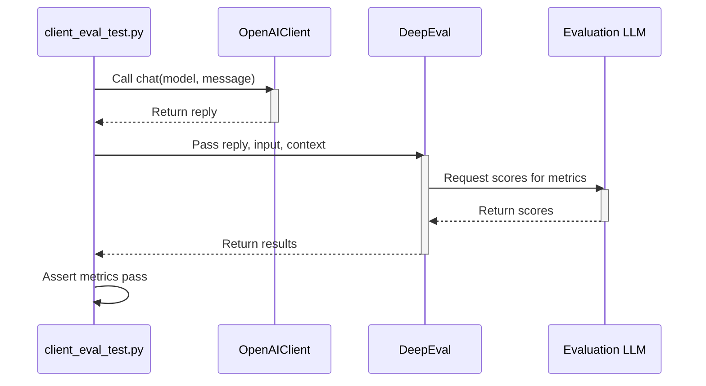
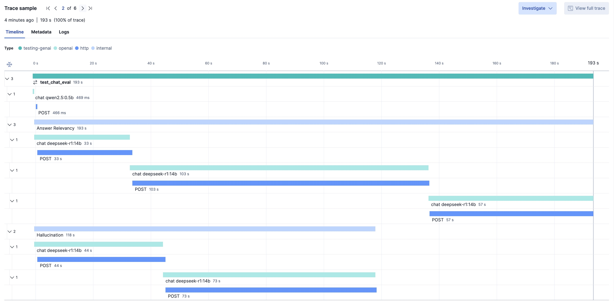
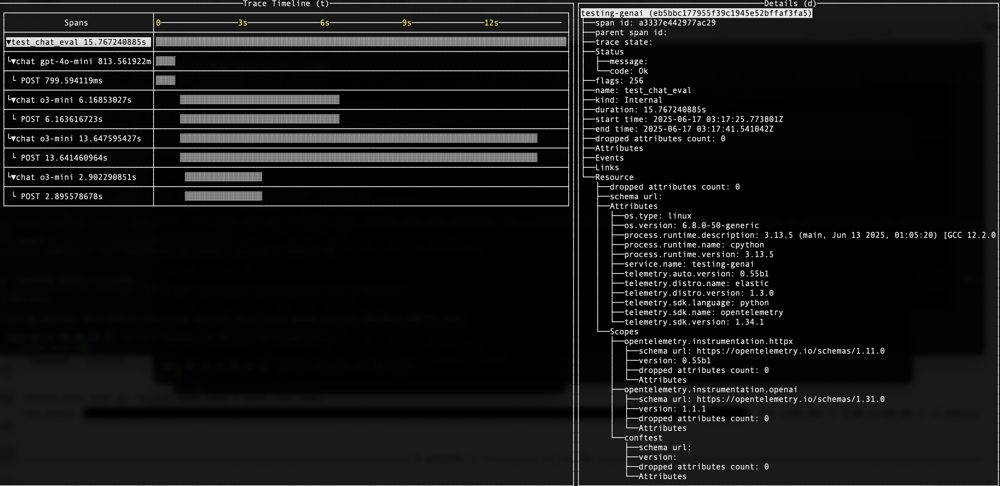

# Evaluate your application using an LLM as a Judge

This exercise teaches you to evaluate LLM responses for relevancy and
hallucinations using the LLM-as-a-judge pattern. You’ll test
`OpenAIClient.chat()` with [DeepEval][deepeval] on:
> Answer in up to 3 words: Which ocean contains Bouvet Island?



## Running tests

Run the evaluation test in [client_eval_test.py](client_eval_test.py) with
`pytest`.

*Note*: Set `EVAL_MODEL` to a strong model (e.g., `gpt-4o` for OpenAI, or
`deepseek-r1:14b` for local LLMs).

<details>
<summary>Docker</summary>

```bash
docker compose run --build --rm eval-test
```

</details>

<details>
<summary>Shell</summary>


Install dependencies:
```bash
pip install -r requirements.txt
pip install -r requirements-dev.txt
```

Bootstrap instrumentation:
```bash
edot-bootstrap --action=install
```

Run the test:
```bash
dotenv -f ../.env run --no-override -- sh -c 'opentelemetry-instrument pytest -m eval'
```

</details>

## Introduction to LLM Evaluation

As discussed in [exercise 5](../05-test), LLMs can give irrelevant answers or
hallucinate. [main_test.py](main_test.py) assumes the answer is correct, if it
has the keyword "atlantic" in its reply to the following question:
> Answer in up to 3 words: Which ocean contains Bouvet Island?

While this catches obviously bad answers, like "pacific ocean", the keyword
"atlantic" would score "Not Atlantic Ocean" a correct answer, where a human
evaluator would not. That said, we can still improve without putting a human
in the loop.

[deepeval][deepeval] uses the LLM-as-a-judge pattern to evaluate responses from
the LLM you use in your application. Considering the nuance discussed in
[exercise 5](../05-test), our goal was answer relevancy and absence of
hallucination. DeepEval has more metrics than these, but starting basic will
cover our goals and keep costs down.

Here's the relevant code:
```python
test_case = LLMTestCase(
    input="Answer in up to 3 words: Which ocean contains Bouvet Island?",
    actual_output=actual_output,
    context=["Atlantic Ocean"],
)

metrics = [
    AnswerRelevancyMetric(threshold=0.7), # 70% relevant
    HallucinationMetric(threshold=0.8), #
]
```

Under the scenes, this uses a large model (OpenAI's gpt-4o by default), to
implement the metrics. These models are bigger and more expensive than our
application's model, but provide insight into why certain answers fail:
* hallucination and irrelevant: "Not Atlantic Ocean"
* not hallucination but irrelevant: "Not the Pacific"

Note, this is still imperfect: LLM evaluation is its own area of expertise.
Datasets that are used to train LLMs may have historical or nuanced data. For
example, [Southern Ocean][southern-ocean] could be considered a correct answer
by humans who are expert at geography and the context of the question. Also, a
human would know that the answer "An ocean name" is incorrect, despite our
above metrics passing it.

*Note*: DeepEval is not the only choice for programmatic evaluation of LLMs. We
mainly chose this due to its built-in OpenTelemetry support. We could perform
similar evaluation using [Ragas][ragas].

## OpenTelemetry

LLM Evaluation failures, especially with LLM-as-a-judge pattern which contains
multiple steps, is easiest to diagnose with a distributed trace.

This exercise adds instrumentation to `pytest` and enables telemetry in
`deepeval` to give more context around both the LLM calls being evaluated, as
well the LLMs used to judge them.

We can use [Elastic Distribution of OpenTelemetry (EDOT) Python][edot-python]
the same way as we did in [exercise 3](../03-opentelemetry) to trace our eval
test:

```bash
dotenv -f ../.env run --no-override -- sh -c 'opentelemetry-instrument pytest -m eval'
```

If your `OTEL_EXPORTER_OTLP_ENDPOINT` was pointed to an Elastic APM server
(e.g. `http://localhost:8200`), you could view the evaluation in Kibana:

http://localhost:5601/app/apm/traces?rangeFrom=now-15m&rangeTo=now



Remember, EDOT Python can export to any OpenTelemetry collector, so if you used
[otel-tui][otel-tui], it would look like this:



## LLM Eval Platforms

While our contrived question may have been helpful in learning these concepts,
most GenAI applications have varied, possibly multi-modal LLM exchanges
including RAG and agent calls. Even armed with tools like DeepEval or Ragas,
you may end up in a situation where you need to enlist human evaluators to
score responses, or take actions on metrics you collect towards stronger models
or prompts.

When your needs become more sophisticated, you need an LLM evaluation platform.
For example, [Arize Phoenix][phoenix] and [Langtrace][langtrace] are both open
source licensed, OpenTelemetry compatible systems. They both have features for
automated and human evaluations, including UI playgrounds and dashboards. Both
of these companies share a lot of knowledge, so look at the [Arize][arize-blog]
and [Langtrace][langtrace-blog] to keep up to date on this topic! 

---
[prev]: ../06-http-replay
[deepeval]: https://docs.confident-ai.com/
[ragas]: https://docs.ragas.io
[southern-ocean]: https://en.wikipedia.org/wiki/Southern_Ocean
[edot-python]: https://github.com/elastic/elastic-otel-python
[otel-tui]: https://github.com/ymtdzzz/otel-tui
[phoenix]: https://docs.arize.com/phoenix
[langtrace]: https://langtrace.ai/
[arize-blog]: https://arize.com/blog/
[langtrace-blog]: https://www.langtrace.ai/blog
