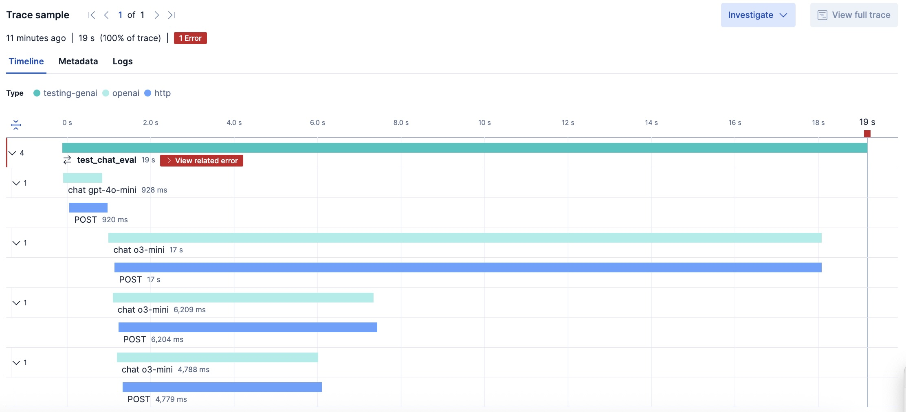

# Unit test driven evaluation of LLMs

This exercise teaches you to evaluate LLM responses in unit tests, using the
[Phoenix Evals][phoenix-evals] library in Pytest.

We'll use two evaluation methods:
 * **Generic** or foundation: This leverages off-the-shelf evaluators like
   Hallucination and Q/A.
 * **Application-specific**: This implies a bespoke evaluator, written to
   cover common errors in your application.

By showing both, you can see how to approach LLM quality from either or both
angles. Doing this in pytest ensures you have rapid feedback close to the code
using the LLM.


## Running tests

Run the evaluation test in [client_eval_test.py](client_eval_test.py) with
`pytest`.

*Note*: The default `EVAL_MODEL` is set to `o3-mini`. For stronger evaluation,
consider setting it to a more capable tool capable thinking model (e.g. `o4`
for OpenAI, or `michaelneale/deepseek-r1-goose` for local LLMs).

<details>
<summary>Docker</summary>

```bash
docker compose run --build --rm eval-test
```

</details>

<details>
<summary>Shell</summary>

Install dependencies:
```bash
pip install -r requirements.txt
pip install -r requirements-dev.txt
```

Bootstrap instrumentation:
```bash
edot-bootstrap --action=install
```

Run the test:
```bash
dotenv -f ../.env run --no-override -- sh -c 'opentelemetry-instrument pytest -m eval'
```

</details>

## Introduction to LLM Evaluation

As discussed in [exercise 5](../05-test), LLMs can give irrelevant answers or
hallucinate. [main_test.py](main_test.py) assumes the answer is correct, if it
has the keyword "atlantic" in its reply to the following question:
> Answer in up to 3 words: Which ocean contains Bouvet Island?

While this catches obviously bad answers, like "pacific ocean", the keyword
"atlantic" would score "Not Atlantic Ocean" a correct answer, where a human
evaluator would not. That said, we can still improve without putting a human
in the loop.

[Phoenix Evals][phoenix-evals] uses LLMs to evaluate responses from the LLM
based on criteria you define. Considering the nuance discussed in
[exercise 5](../05-test), our goal was answer correctly and without
hallucination (factually). Phoenix Evals has more evaluators than these, but
starting basic will cover our goals and keep costs down.

Here's the relevant code for running built-in evaluators:
```python
test_case = pd.DataFrame({
    "input": ["Answer in up to 3 words: Which ocean contains Bouvet Island?"],
    "output": [actual_output],
    "reference": ["Atlantic Ocean"],
})

qa_eval, hallucination_eval = run_evals(
    dataframe=test_case,
    evaluators=[
        QAEvaluator(eval_model),
        HallucinationEvaluator(eval_model),
    ],
    provide_explanation=True,
)
```

Under the scenes, this uses a tool capable, thinking model (OpenAI's `o3-mini`
by default), to implement the evaluators. These models are typically more
capable than our application's model, but provide insight into why certain
answers fail:
* hallucination and irrelevant: "Not Atlantic Ocean"
* not hallucination but irrelevant: "Not the Pacific"

Built-in evaluators are sometimes known as **Generic** evaluators. These are
re-usable, which makes them attractive. However, failures are not necessarily
related to business metrics, and can be confusing to interpret.

Note, this is still imperfect: LLM evaluation is its own area of expertise.
Datasets that are used to train LLMs may have historical or nuanced data. For
example, [Southern Ocean][southern-ocean] could be considered a correct answer
by humans who are expert at geography and the context of the question. Also, a
human would know that the answer "An ocean name" is incorrect, despite our
above evaluators passing it.
 
Error analysis is considered a **Application-specific** approach which results in a
classification of common errors your application must prevent.

[OceanEvaluator](ocean_evaluator.py) is an example of a Application-specific evaluator,
made due to common errors such as incorrect ocean name, or marking a valid
answer like "South Atlantic Ocean" as incorrect.

*Note*: Phoenix Evals is not the only choice for programmatic evaluation of LLMs.
We could perform similar evaluation using [deepeval][deepval] or [Ragas][ragas].

## OpenTelemetry

LLM Evaluation failures can be the result of multiple steps, so easier to
diagnose with a distributed trace.

This exercise adds instrumentation to `pytest` to give more context around both the
LLM calls being evaluated, as well the LLMs used to evaluate them.

We can use [Elastic Distribution of OpenTelemetry (EDOT) Python][edot-python]
the same way as we did in [exercise 3](../03-opentelemetry) to trace our eval
test:

```bash
dotenv -f ../.env run --no-override -- sh -c 'opentelemetry-instrument pytest -m eval'
```

If your `OTEL_EXPORTER_OTLP_ENDPOINT` was pointed to an Elastic Distribution of
OpenTelemetry (EDOT) Collector (e.g. `http://localhost:4318`), you could view
the evaluation in Kibana:

http://localhost:5601/app/apm/traces?rangeFrom=now-15m&rangeTo=now



Remember, EDOT Python can export to any OpenTelemetry collector, so if you used
[otel-tui][otel-tui], it would look like this:


## LLM Eval Platforms

While our contrived question may have been helpful in learning these concepts,
most GenAI applications have varied, possibly multi-modal LLM exchanges
including RAG and agent calls. Even armed with eval scripts, you may end up in
a situation where you need to enlist human evaluators to score responses, or
take actions on metrics you collect towards stronger models or prompts.

When your needs become more sophisticated, you need an LLM evaluation platform.
For example, [Arize Phoenix][phoenix] and [Langtrace][langtrace] are both open
source licensed, OpenTelemetry compatible systems. They both have features for
automated and human evaluations, including UI playgrounds and dashboards. Both
of these companies share a lot of knowledge, so look at the [Arize][arize-blog]
and [Langtrace][langtrace-blog] to keep up to date on this topic! 

In the [next section](../08-eval-platform/), we will update our eval script to
support evals of data from a running application using Arize Phoenix.

---
[deepeval]: https://docs.confident-ai.com/
[phoenix-evals]: https://arize.com/docs/phoenix/evaluation/llm-evals
[ragas]: https://docs.ragas.io
[southern-ocean]: https://en.wikipedia.org/wiki/Southern_Ocean
[edot-python]: https://github.com/elastic/elastic-otel-python
[otel-tui]: https://github.com/ymtdzzz/otel-tui
[phoenix]: https://docs.arize.com/phoenix
[langtrace]: https://langtrace.ai/
[arize-blog]: https://arize.com/blog/
[langtrace-blog]: https://www.langtrace.ai/blog
