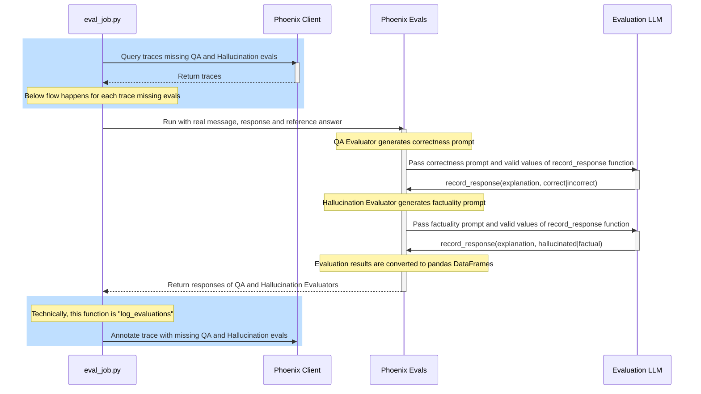
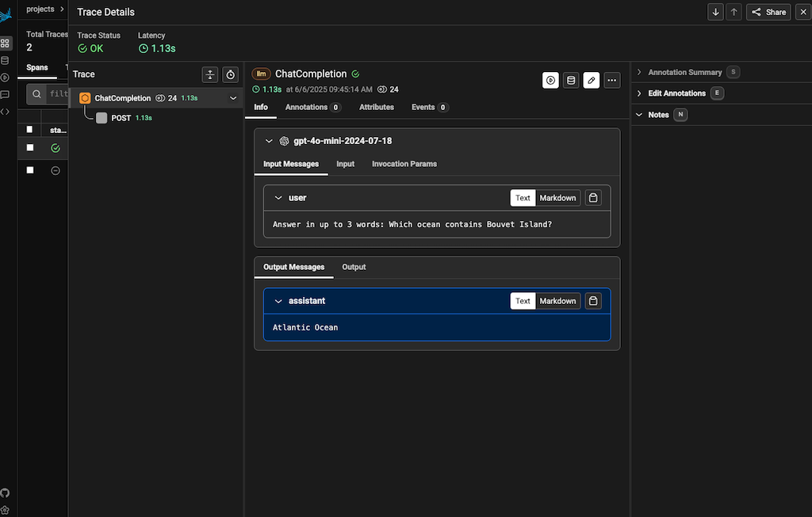
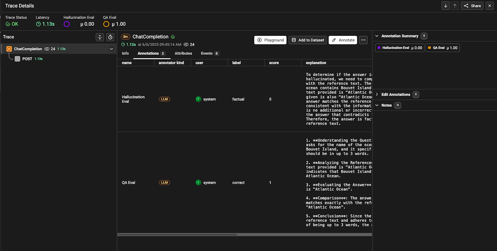

# Run LLM evaluations on production requests

This exercise teaches you to evaluate LLM responses for correctness and
factuality via an LLM Eval Platform, [Arize Phoenix][phoenix].

Specifically, we run evals via separate job, decoupling production requests
from their evaluation. Differences from the [previous exercise][prev] are
highlighted below:




## Ensure you are using Phoenix

This exercise only works if you are using [Phoenix][phoenix] as your
OpenTelemetry collector. If you are using something else, shut it down and
reconfigure your ../.env for Phoenix using instructions in the
[Project README](../README.md).

Verify your Phoenix environment is running by accessing http://localhost:6006/

## Run main to generate traces

Choose one of the following ways to run [main.py](main.py) with OpenTelemetry.
Run multiple times, so that you have enough traces to evaluate.

<details>
<summary>Docker</summary>

```bash
docker compose run --build --rm main
```

</details>

<details>
<summary>Shell</summary>

This is the same as what you did in [exercise 4](../04-main), except it uses
OpenInference conventions when exporting traces to Phoenix.

So, first replace OpenAI OpenTelemetry instrumentation with
[OpenInference][openinference] like this:
```bash
pip uninstall -y elastic-opentelemetry-instrumentation-openai
pip install openinference-instrumentation-openai
```

Now, run [main.py](main.py).
```bash
python3 main.py
```

</details>

You can view uploaded traces at http://localhost:6006.



## Log evaluations to Phoenix

Pick a method to run [eval_job.py](eval_job.py). This searches for traces that
have not been evaluated yet, and runs evaluations against them. The evaluations
are logged as annotations on the `ChatCompletion` spans.

*Note*: The default `EVAL_MODEL` is set to `o3-mini`. For stronger evaluation,
consider setting it to a more capable tool capable thinking model (e.g. `o4`
for OpenAI, or `michaelneale/deepseek-r1-goose` for local LLMs).

<details>
<summary>Docker</summary>

```bash
docker compose run --build --rm eval-job
```

</details>

<details>
<summary>Shell</summary>

```bash
python3 eval_job.py
```
</details>

Eval results will have been uploaded to Phoenix. You can find them as
annotations on any `ChatCompletion` span.



## Difference between this and eval tests

[eval_job.py](eval_job.py) decouples evaluation from production code and
request lifecycle where the [previous exercise][prev] runs both the LLM request
and its evaluation in the same runner.

[main.py](main.py) exports traces to [Arize Phoenix][phoenix] the same way as
[exercise 4](../04-main). This works because Phoenix is OpenTelemetry
compatible.

[eval_job.py](eval_job.py) is similar to the previous exercise
[client_eval_test.py](client_eval_test.py), except instead of running an LLM
request it looks up the results from a previous run, in Phoenix. 

Another main difference is that this job logs the evaluation back to a trace
when complete, which avoids redundant evaluation when run again.

## Does this only work with Phoenix?

The [Phoenix Evals][phoenix-evals] code in [eval_job.py](eval_job.py) is not
tightly coupled to Phoenix, and could be used in another system or swapped for
a different eval library, even in a different language. For example, if the job
was written in TypeScript, you could use [@mastra/evals][mastra/evals].

What's system specific is the relationship between traces and evaluation
results: data conventions and how evals are stored are platform specific.

The approach used by [OpenInference][openinference] is stable, but not widely
used outside [Phoenix][phoenix]. For example, [Langtrace][langtrace] requires a
different SDK to accomplish similar.

This is likely to be the norm until more platforms support OpenInference or
an alternative. For example, OpenTelemetry itself stalled defining
[eval conventions][otel-evals]. Even if conventions were defined, a process to
apply them to existing traces would need to exist in released SDKs, and be
adopted by popular platforms.

In summary, even if trace data can be viewed on any OpenTelemetry compatible
platform, usable LLM evals require porting work for alternative platforms.

---
[prev]: ../07-eval
[openinference]: https://github.com/Arize-ai/openinference
[phoenix]: https://phoenix.arize.com/
[phoenix-evals]: https://arize.com/docs/phoenix/evaluation/llm-evals
[mastra/evals]: https://www.npmjs.com/package/@mastra/evals
[langtrace]: https://github.com/Scale3-Labs/langtrace-python-sdk
[otel-evals]: https://github.com/open-telemetry/semantic-conventions/pull/1322
