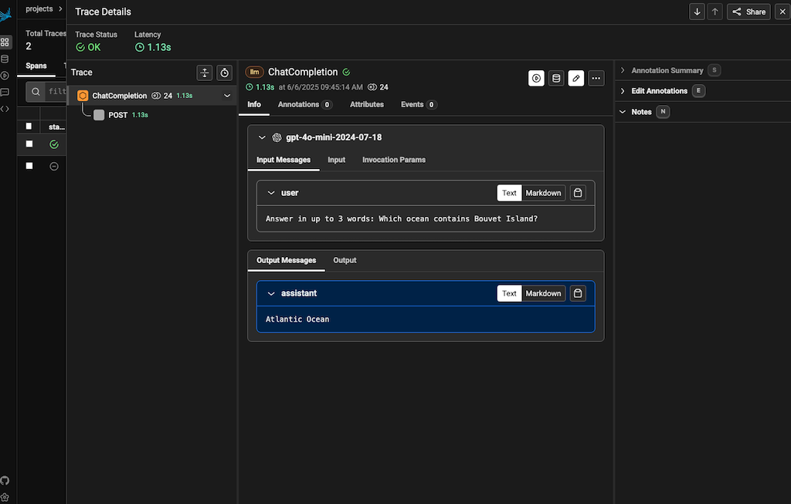
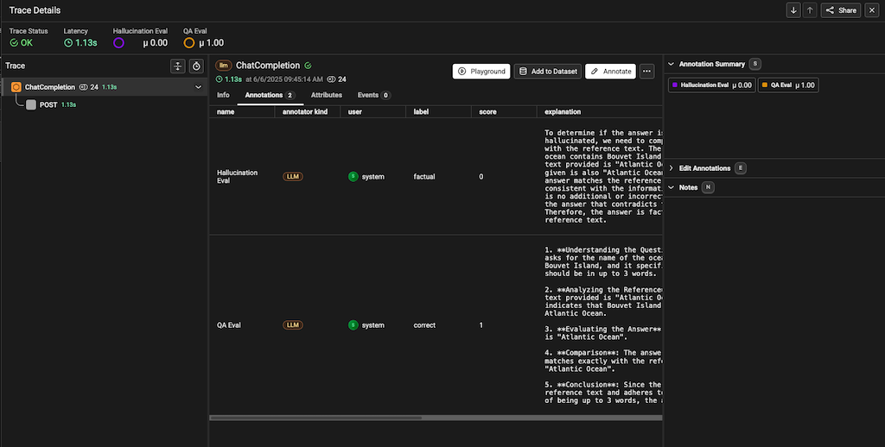

# Run LLM evaluations against data generated from a running app

This exercise teaches you to evaluate LLM responses for relevancy and
hallucinations using the LLM-as-a-judge pattern for data generated from
a running app. You’ll test `OpenAIClient.chat()`, exporting traces to
[Phoenix][phoenix] to then load and process with [Phoenix Evals][phoenix-evals].


## Start Phoenix

Phoenix is a trace backend optimized for Gen AI. Start it to allow collecting
traces and eval results.

```bash
docker compose up -d phoenix
```

## Send traces

Run the simple Gen AI application in [main.py](main.py). It will export telemetry
to Phoenix. You can run it a few times to have a few sample traces to check out.

<details>
<summary>Docker</summary>

```bash
docker compose run --build --rm main
```

</details>

<details>
<summary>Shell</summary>


Install dependencies:
```bash
pip install -r requirements.txt
pip install -r requirements-dev.txt
```

Bootstrap instrumentation:
```bash
edot-bootstrap --action=install
```

Run the test:
```bash
OTEL_METRICS_EXPORTER=none OTEL_LOGS_EXPORTER=none python3 main.py
```

</details>

You can view uploaded traces at http://localhost:6006.



Arize currently requires its own instrumentation to send structrued Gen AI data
to Phoenix, so we have two LLM spans, one from EDOT and one from Arize.

Now let's run evals against the trace data.

*Note*: Set `EVAL_MODEL` to a strong model (e.g., `gpt-4o` for OpenAI, or
`deepseek-r1:14b` for local LLMs).

<details>
<summary>Docker</summary>

```bash
docker compose run --build --rm eval
```

</details>

<details>
<summary>Shell</summary>

Run the eval:
```bash
dotenv -f ../.env run --no-override python3 run_evals.py
```

Eval results will have been uploaded to Phoenix. You can find them as
annotations on any `ChatCompletion` span.



</details>

---
[prev]: ../06-http-replay
[phoenix]: https://phoenix.arize.com/
[phoenix-evals]: https://arize.com/docs/phoenix/evaluation/llm-evals
[ragas]: https://docs.ragas.io
[southern-ocean]: https://en.wikipedia.org/wiki/Southern_Ocean
[edot-python]: https://github.com/elastic/elastic-otel-python
[otel-tui]: https://github.com/ymtdzzz/otel-tui
[phoenix]: https://docs.arize.com/phoenix
[langtrace]: https://langtrace.ai/
[arize-blog]: https://arize.com/blog/
[langtrace-blog]: https://www.langtrace.ai/blog
