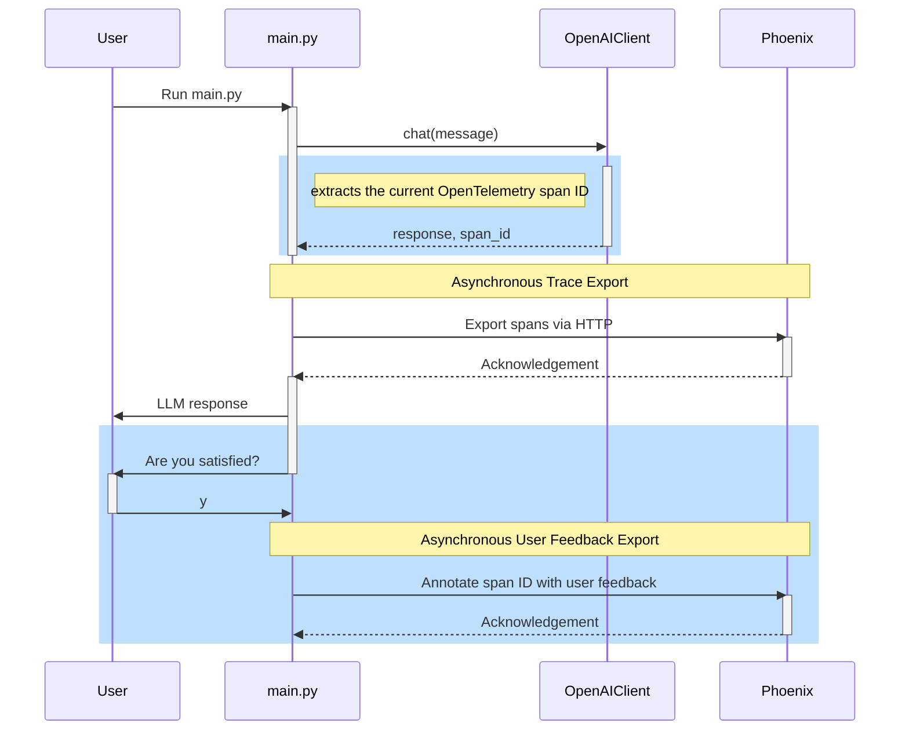
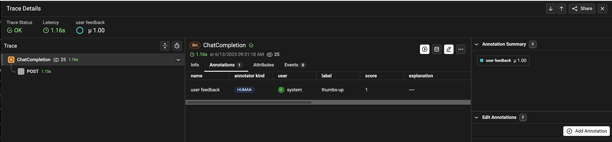

# Attach user feedback to application requests

This exercise teaches you how to incorporate human feedback on real LLM
responses using [Arize Phoenix][phoenix].

Similar to automated evaluation in the [previous exercise][prev], human
feedback is captured in OpenTelemetry traces, after the LLM response is
complete. Health of the application can be derived from LLM or human
evaluation, or a combination of both.

Human feedback can be recorded without application code changes, in the LLM
Eval Platform, or in the application itself. This example shows how to capture
thumbs up or down feedback style feedback in the application. Differences from
[exercise 4](../04-main) are highlighted below:



## Ensure you are using Phoenix

This exercise only works if you are using [Phoenix][phoenix] as your
OpenTelemetry collector. If you are using something else, shut it down and
reconfigure your ../.env for Phoenix using instructions in the
[Project README](../README.md).

Verify your Phoenix environment is running by accessing http://localhost:6006/

## Run main with user feedback

Choose one of the following ways to run [main.py](main.py) with the
`--feedback` argument which handles the flow described above.

<details>
<summary>Docker</summary>

```bash
docker compose run --build --rm main --feedback
```

</details>

<details>
<summary>Shell</summary>

This is the same as what you did in [the previous exercise][prev], except it
adds another dependency needed for span annotations.

So, first replace OpenAI OpenTelemetry instrumentation with
[OpenInference][openinference] like this:
```bash
pip uninstall -y elastic-opentelemetry-instrumentation-openai
```

Then, install the new requirements like so:
```bash
pip install -r requirements.txt
```

Now, run [main.py](main.py).
```bash
python3 main.py --feedback
```

</details>

You can view traces with feedback at http://localhost:6006.



## Annotating the correct OpenTelemetry span

As noted in Arize's [capture feedback documentation][feedback-doc], the key
challenge is to attach user feedback to the correct OpenTelemetry span: A real
application trace often has spans unrelated to LLMs (like database queries).

The OpenAI Python SDK lacks a callback API to capture OpenTelemetry span IDs
during requests. To work around this, we monkey patch a function called
internally by the OpenAI Python SDK when doing a chat completion request.
This ensures feedback is connected to the `ChatCompletion` span, vs its parent
or its child.

The critical code related to this is in [client.py](client.py):

```python
# build_request is called inside chat.completions, before the real HTTP request
def span_id_capturing_build_request(self, *args, **kwargs):
    ctx = trace.get_current_span().get_span_context()
    span_id_var.set(ctx.span_id)
    return original_build_request(self, *args, **kwargs)
```

## Offline unit tests

User feedback is implemented with the Phoenix Client SDK, described in Arize's
[capture feedback documentation][feedback-doc]. As Phoenix is accessed as a web
service, [user_feedback_test.py](user_feedback_test.py) is tested the same way
as we did in [exercise 6](../06-http-replay), VCR tests.

---
[prev]: ../08-eval-platform
[openinference]: https://github.com/Arize-ai/openinference
[phoenix]: https://phoenix.arize.com/
[feedback-doc]: https://arize.com/docs/phoenix/tracing/how-to-tracing/feedback-and-annotations/capture-feedback

