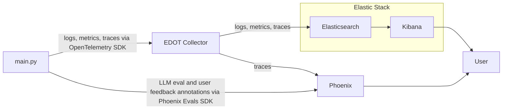
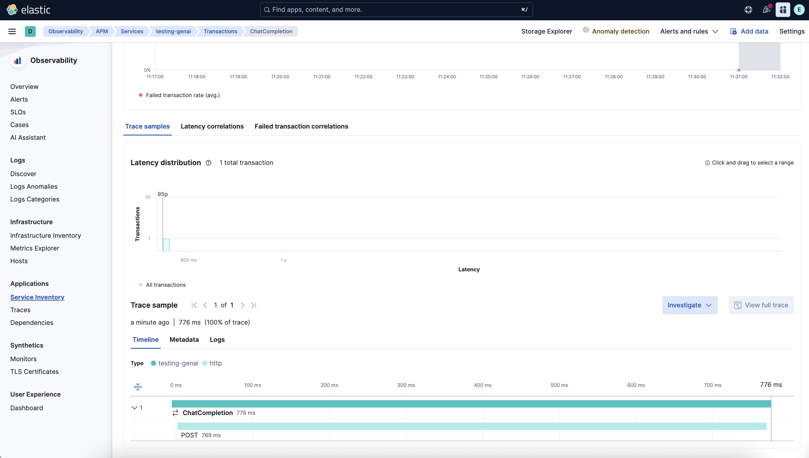
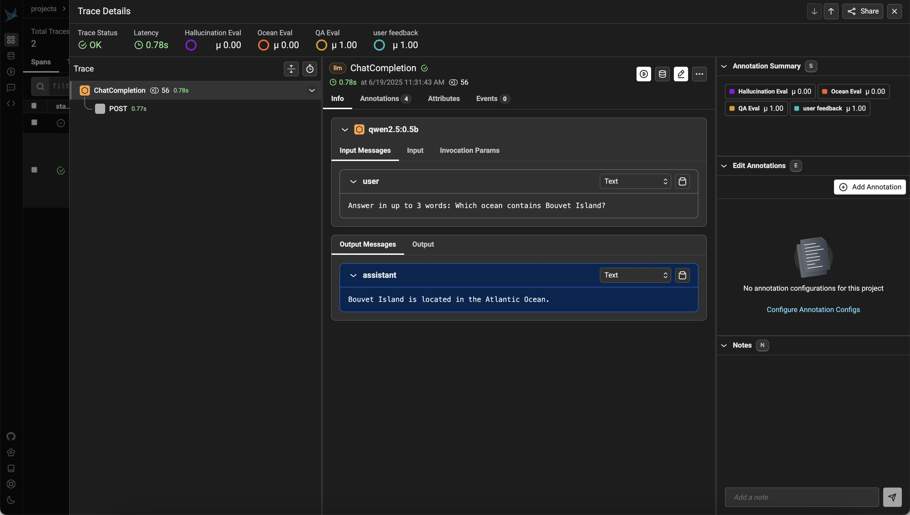

# Elastic Stack and Phoenix via EDOT Collector

This exercise teaches you how to use the Elastic Distribution of OpenTelemetry
[(EDOT) collector][edot-collector] to send observability data (signals) to both
[Elastic Stack][elastic-stack] and [Arize Phoenix][phoenix]. 

[docker-compose-elastic-phoenix.yml](docker-compose-elastic-phoenix.yml) starts
services for both platforms, allowing the user to use both [Kibana][kibana] and
[Phoenix][phoenix] UIs to view the same trace.



Here is a screen capture of the same trace in both systems:
[Kibana][kibana]

[Phoenix][phoenix]:



## Launch the combined stack

Before you begin, make sure you have shut down any previously started stack!

To start a local Elastic Stack with Arize Phoenix in the background, run this:
```bash
docker compose -f docker-compose-elastic-phoenix.yml up --force-recreate --wait -d
```

Clean up when finished, like this:
```bash
docker compose -f docker-compose-elastic-phoenix.yml down
```

## Run main with user feedback and evaluate it

We'll first run [main.py](main.py) with user feedback (from [exercise 9][e09])

```bash
docker compose run --build --rm main --feedback
```

Now, we'll evaluate it with [eval_job.py](eval_job.py) from (from [exercise 8][e08]).
```bash
docker compose run --build --rm eval-job
```

## View the same trace in Kibana and Phoenix UIs

You can access Kibana like this, authenticating with the username "elastic" and
password "elastic":

http://localhost:5601/app/apm/traces?rangeFrom=now-15m&rangeTo=now

You can access Arize Phoenix like this, with authentication disabled:

http://localhost:6006

## Why Combine Elastic Stack and Phoenix?

**[Elastic Stack][elastic-stack]** is often already running in organizations,
regardless of if they are using it for Search AI, Observability, Security or
a myriad of other use cases. The [Kibana][kibana] UI excels at correlating data
across use cases, even when they are not Observability in nature.

**[Arize Phoenix][phoenix]** focuses on evaluation, experimentation and
optimization of LLM applications. Its UI and features are specialized for these
use cases, and go beyond traditional observability tools.

The benefits of combining these tools are:
* You can see the same trace in Kibana and Phoenix
* You can see metrics and logs not supported by Phoenix in Kibana.
* You can see LLM evals and annotations not supported in Kibana in Phoenix

The costs of this approach are:
* Cost of running both systems, as they require separate resources.
* Configuration of the EDOT collector to additionally send traces to Phoenix.
* Navigation between two different UIs can be cumbersome.

This tradeoff can be worthwhile for sites who can afford to get the best of
both worlds.

## How does this work?

**[EDOT Collector][edot-collector]** is an OpenTelemetry collector that writes
telemetry data directly to Elasticsearch. It can be configured to also export
traces over HTTP to other systems.

**[Arize Phoenix][phoenix]** is an OpenTelemetry compatible AI Observability
and Evaluation tool. It receives traces in OpenTelemetry's OTLP format.

So, in summary, the EDOT collector needs additional configuration to send
traces already sent to Elasticsearch to Arize Phoenix.

[docker-compose-elastic-phoenix.yml](docker-compose-elastic-phoenix.yml) adds
a second pipeline to the EDOT collector, which does has these differences from
the default Elastic Stack docker compose file:
```diff
>   phoenix-collector-config:
>     content: |
>       exporters:
>         otlphttp:
>           endpoint: http://phoenix:6006
>       service:
>         pipelines:
>           traces/phoenix:
>             receivers: [otlp]
>             exporters: [otlphttp]
> 
145,147c173,175
<     command: [
<       "--config=/etc/otelcol-contrib/config.yaml",
<     ]
---
>     command:
>       - "--config=/etc/otelcol-contrib/config.yaml"
>       - "--config=/etc/otelcol-contrib/phoenix-config.yaml"
150a179,180
>       - source: phoenix-collector-config
>         target: /etc/otelcol-contrib/phoenix-config.yaml
```

---
[e08]: ../08-eval-platform
[e09]: ../09-user-feedback
[edot-collector]: https://www.elastic.co/docs/reference/opentelemetry/edot-collector/
[phoenix]: https://arize.com/docs/phoenix
[elastic-stack]: https://www.elastic.co/elastic-stack
[kibana]: https://www.elastic.co/kibana
