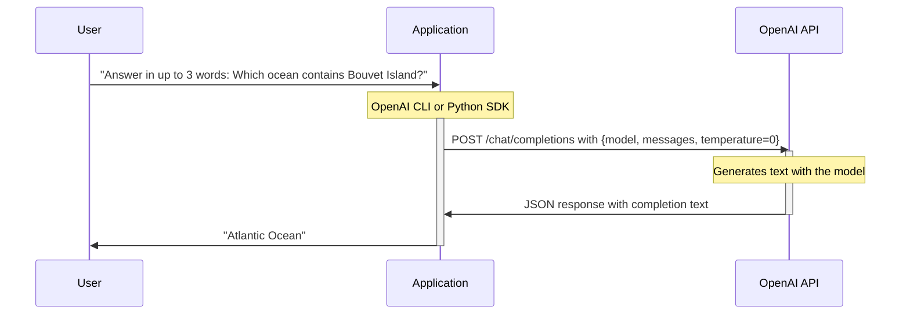

# Testing GenAI Applications Workshop

This workshop walks you through testing Generative AI (GenAI) applications
using the OpenAI CLI, SDK and a compatible LLM provider.

Each exercise builds on the last, so do them in order! We'll start with the
OpenAI CLI, and how to inspect traffic to the OpenAI API using a proxy and how
to enable observability with OpenTelemetry. We'll then get to coding in Python,
and write our first test in consideration of LLM quirks like variability and
hallucinations. We'll get progressively more sophisticated with offline testing
before we complete with evals using the LLM-as-a-judge pattern.

Let's begin!

## Example Application Flow

Regardless of whether we use the OpenAI CLI or its Python SDK, our example
remains consistent. The user asks a simple question:

> Answer in up to 3 words: Which ocean contains Bouvet Island?

We configure `temperature=0` to ensure a consistent LLM response, ideally
"Atlantic Ocean" or a close variant. However, the LLM might offer a debatable
answer like "Southern Ocean" or even hallucinate, which adds an engaging twist
to the learning experience!

We’ll explore this example first with the OpenAI CLI and then with the Python
SDK. Since both tools interact with the OpenAI API in the same way, the flow
remains identical:



## Exercises

This workshop is designed to run in order. Make sure you perform all
prerequisites before starting the exercises.

1. [Use the OpenAI CLI](01-start): Use the OpenAI CLI to ask a simple question.
2. [Inspect OpenAI traffic with mitmproxy](02-proxy): See
  underlying HTTP requests made by the OpenAI CLI.
3. [Trace OpenAI traffic with OpenTelemetry](03-opentelemetry): Transparently
  export logs, metrics and traces from the OpenAI CLI.
4. [Write an OpenAI application](04-main): Write a Python script that asks the
  same question we did with the OpenAI CLI.
5. [Integration test your application](05-test): Write a test that compensates
  for variability or hallucinations in the LLM's response.
6. [Unit test your application with recorded HTTP responses](06-http-replay):
  Record traffic from the OpenAI SDK, so that you can run unit tests offline.
7. [Evaluate your application using an LLM as a Judge](07-eval): Use
  DeepEval to score relevancy or hallucinations in your LLM responses.

## Prerequisites

Docker and Python are required. You'll also need an OpenAI API compatible
inference platform and an OpenTelemetry collector.

First of all, you need to be in a directory that contains this repository. If
you haven't yet, you get one like this:
```bash
curl -L https://github.com/elastic/testing-genai-applications/archive/refs/heads/main.tar.gz | tar -xz
cd testing-genai-applications-main
```

### Python

All examples use the same Python virtual environment. This reduces repetition,
even if some examples need more dependencies than others.

First, set up a Python virtual environment like this:
```bash
python3 -m venv .venv
source .venv/bin/activate
pip install --upgrade pip
pip install 'python-dotenv[cli]'
```

### OpenAI

Exercises use either the OpenAI CLI or the Python SDK it wraps. OpenAI SDKs
use the following main environment variables for configuration:
* `OPENAI_BASE_URL` - The OpenAI API base URL which defaults to https://api.openai.com/v1
* `OPENAI_API_KEY` - Your [Secret Key](https://platform.openai.com/account/api-keys).

If you are using an alternate inference platform, you will need to change the
`OPENAI_BASE_URL` and if it is unauthenticated, pass a fake value for
`OPENAI_API_KEY`.

You can choose one of the following options to set up `.env` with your
preferred inference platform:

*Note*: Do not share your `.env` file or API key publicly.

<details>
<summary>OpenAI Platform</summary>

[OpenAI Platform](https://platform.openai.com/) is a cloud-based service for
accessing OpenAI models. It requires an API key and may incur usage costs.

To use OpenAI, do the following:

1. Copy [.env.openai](.env.openai) to `.env`
2. Set `OPENAI_API_KEY` in your `.env` file to your [Secret Key](https://platform.openai.com/account/api-keys).

</details>

<details>
<summary>Ollama</summary>

[Ollama](https://ollama.com/) is an open-source solution for running models
locally. It is free to use, but requires sufficient computational resources.

To start and use Ollama, do the following:

1. Ensure `ollama` is installed
   - On macOS/Linux: `brew install ollama`
   - For Windows or otherwise, see the [download page][ollama-dl].
2. Copy [.env.ollama](.env.ollama) to `.env`
3. In a separate terminal, run `OLLAMA_HOST=0.0.0.0 ollama serve`
   - This accepts OpenAI requests for any model on http://localhost:11434/v1
4. In this terminal, pull the chat and eval models
   - `dotenv run -- sh -c 'ollama pull ${CHAT_MODEL}'`
   - `dotenv run -- sh -c 'ollama pull ${EVAL_MODEL}'`

</details>

<details>
<summary>RamaLama</summary>

[RamaLama](https://ramalama.ai/) is an open-source solution for running models
locally. It is free to use, but requires sufficient computational resources.

1. Make sure `ramalama` is installed
   - On macOS/Linux: `brew install ramalama`
   - For Windows or otherwise, see the [installation guide][ramalama-dl].
2. Copy [.env.ramalama](.env.ramalama) to `.env`
3. In a separate terminal, run `dotenv run -- sh -c 'ramalama serve ${CHAT_MODEL}'`
   - This accepts OpenAI requests for ${CHAT_MODEL} on http://localhost:8080/v1

</details>

### OpenTelemetry

OpenTelemetry is a framework used to collect and export telemetry signals
(logs, metrics, and traces) from your applications.

For most examples in this workshop, you’ll need to configure OpenTelemetry to
export this data to either your console or a collector. Follow the steps below
to set up your preferred export method.

<details>
<summary>Console</summary>

If you want to view logs, metrics, and traces directly in your terminal, you
can configure OpenTelemetry to export telemetry data to the console.

To set this up, append [.env.otel.console](.env.otel.console) to your `.env`
file like this:
```bash
cat .env.otel.console >> .env
```

</details>

<details>
<summary>Elastic Stack</summary>

Elastic Stack is an open-source search platform. Its APM Server is compatible
with OpenTelemetry Collector; Kibana can visualize logs, metrics and traces.

To use a local Elastic Stack with APM server, append
[.env.otel.elastic](.env.otel.elastic) to your `.env` file like this:
```bash
cat .env.otel.elastic >> .env
```

#### Local Elastic Stack

Below starts Elasticsearch, Kibana, and APM Server and only requires Docker 
installed. Before you begin, ensure you have free CPU and memory on your Docker
host (laptop). Assume 4 cpus and 4GB memory for the containers in the Elastic
Stack.

First, get a copy of docker-compose-elastic.yml
```bash
wget https://raw.githubusercontent.com/elastic/elasticsearch-labs/refs/heads/main/docker/docker-compose-elastic.yml
```

Next, start this Elastic Stack in the background:
```bash
docker compose -f docker-compose-elastic.yml up --force-recreate --wait -d
```

If you start your Elastic stack  this way, you can access Kibana like this,
authenticating with the username "elastic" and password "elastic":

http://localhost:5601/app/apm/traces?rangeFrom=now-15m&rangeTo=now

Clean up when finished, like this:
```bash
docker compose -f docker-compose-elastic.yml down
```

</details>

<details>
<summary>otel-tui</summary>

[otel-tui][otel-tui] is an easy to navigate, single binary OpenTelemetry system
that runs in your terminal.

Choose one of the following ways to run `otel-tui` in a separate terminal.

To run in docker:
```bash
docker run --rm -it --name otel-tui ymtdzzz/otel-tui:latest
```

Or, to run on your host:
```bash
brew install ymtdzzz/tap/otel-tui
# or go install github.com/ymtdzzz/otel-tui@latest
otel-tui
```

</details>

---
[ollama-dl]: https://ollama.com/download
[ramalama-dl]: https://github.com/containers/ramalama?tab=readme-ov-file#install
[otel-tui]: https://github.com/ymtdzzz/otel-tui
